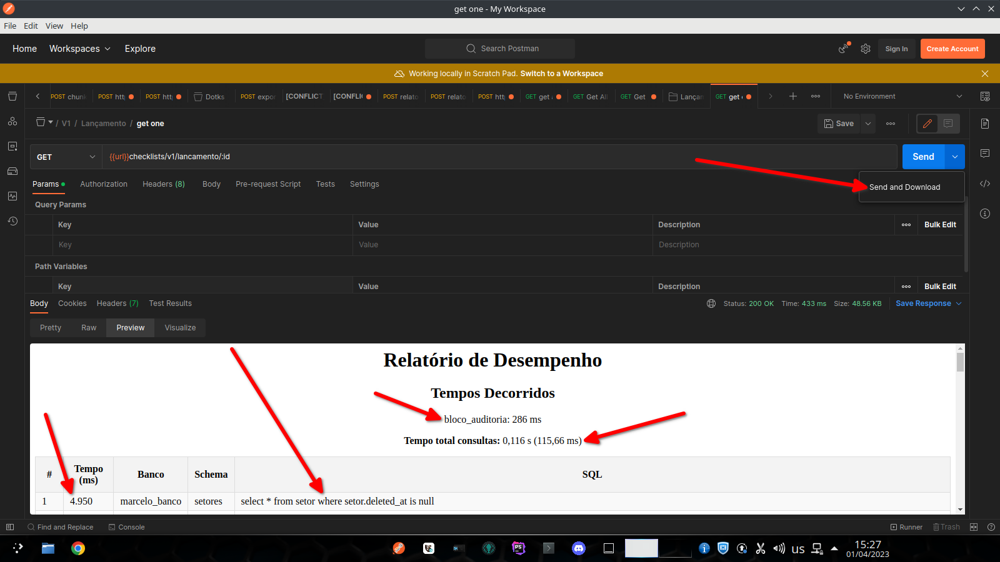

<div class="markdown prose w-full break-words dark:prose-invert dark">
  <h1>Documentação da Classe PerformanceHelper</h1>
  <p><a href="https://github.com/MarceloFullStack" target='_blank'>Autor: Marcelo Fullstack - Desenvolvedor Web especialista em ReactJS, Laravel e PostgreSQL</p></a>
  <h2>Sumário</h2>
  <ol>
    <li>
      <a href="#introducao">Introdução</a>
    </li>
    <li>
      <a href="#instalacao">Instalação</a>
    </li>
    <li>
      <a href="#como-usar">Como Usar</a>
      <ul>
        <li>
          <a href="#iniciando-a-medição-de-desempenho">Iniciando a medição de desempenho</a>
        </li>
        <li>
          <a href="#encerrando-a-medição-de-desempenho">Encerrando a medição de desempenho</a>
        </li>
        <li>
          <a href="#tags">Tags</a>
        </li>
        <li>
          <a href="#exibicao-de-resultados">Exibição de resultados</a>
        </li>
      </ul>
    </li>
    <li>
      <a href="#uso-com-postman">Uso com Postman</a>
    </li>
    <li>
      <a href="#conclusao">Conclusão</a>
    </li>
  </ol>
  <h2 id="introducao">Introdução</h2>
  <p>A classe <code>PerformanceHelper</code> é uma ferramenta de monitoramento de desempenho para aplicações Laravel. Com ela, você pode medir o tempo de execução de blocos de código e acompanhar as consultas SQL executadas durante a execução do bloco facilitando debugar as consultas, basta copiar o sql e colar no seu software sql. OBS: testado apenas com postgre no momento, qualquer feedback será bem-vindo] </p>
  
  <br>
  

  <h2 id='instalacao'>Instalação</h2>
  <ol>
    <li>Copie o código da classe <code>PerformanceHelper</code> para um novo arquivo chamado <code>PerformanceHelper.php</code> dentro do diretório <code>app\Helpers</code> do seu projeto Laravel. </li>
    <li>Adicione o namespace <code>App\Helpers</code> no topo do arquivo ou outro namespace caso queira salvar a classe em outro local. </li>
  </ol>
  <h2 id='como-usar'>Como Usar</h2>
  <h3 id='iniciando-a-medição-de-desempenho'>Iniciando a medição de desempenho</h3>
  <p>Para começar a medir o desempenho de um bloco de código, chame o método estático start() da classe PerformanceHelper:</p> 

```php 
//caso nao exista consulta sql e vc precisar verificar so o desempenho daquele bloco de codigo, tipo um foreach aninhado em outro foreach
PerformanceHelper::start('nome_bloco'); 
//seu bloco de codigo
PerformanceHelper::end();

//>>>>>>>>>>>>>>>>>>>>>>>>>>>>>>>>>>>>>>>>>

//caso exista consulta sql e vc precisar verificar o desempenho daquele bloco de codigo e as consultas sql
//importante lembrar que voce pode ignorar bancos especificos ou esquemas especificos
PerformanceHelper::start($blockName, $sql = true, array $ignoredConnections = [], array $ignoredSchemas = []); 
//seu bloco de codigo
PerformanceHelper::end();

```
<h1>Um exemplo mais real</h1>

```php
namespace App\Http\Controllers\Api;

use App\Http\Controllers\Controller;
use App\Helpers\PerformanceHelper;
use App\Models\Produto;

class ProdutosController extends Controller
{
    public function index()
    {
        PerformanceHelper::start('consulta_produtos', true);

        $produtos = Produto::query()
            ->select('produtos.*', 'categorias.nome as categoria_nome')
            ->join('categorias', 'categorias.id', '=', 'produtos.categoria_id')
            ->groupBy('produtos.id')
            ->orderBy('produtos.nome')
            ->get();

        PerformanceHelper::end();

        return response()->json($produtos);
    }
}

```
  <h3 id='encerrando-a-medição-de-desempenho'>Encerrando a medição de desempenho</h3>
  <p>Para encerrar a medição de desempenho de um bloco de código, chame o método estático <code>end()</code> da classe <code>PerformanceHelper</code>: </p> 

```php 
PerformanceHelper::end(); 
``` 
<h3 id='tag'>Tags</h3>
  <p>Você pode adicionar tags ao seu código para obter informações específicas sobre a execução de determinados blocos. Para isso, use o método <code>start()</code> com o parâmetro <code>$blockName</code>: </p> 
  <ul>
    <li>
      <code>$blockName</code>: Nome do bloco de código que está sendo monitorado.
    </li>
    <li>
      <code>$sql</code> (opcional): Se <code>true</code>, a classe irá registrar as consultas SQL executadas durante a execução do bloco. O valor padrão é <code>false</code>.
    </li>
    <li>
      <code>$ignoredConnections</code> (opcional): Um array com os nomes das conexões de banco de dados que devem ser ignoradas. O valor padrão é um array vazio.
    </li>
    <li>
      <code>$ignoredSchemas</code> (opcional): Um array com os nomes dos esquemas de banco de dados que devem ser ignorados. O valor padrão é um array vazio.
    </li>
  </ul>

 ```php 
 PerformanceHelper::start('MeuBloco', true); 
 ``` 
  <h3 id={exibicao-de-resultados}>Exibição de resultados</h3>
  <p>Os resultados serão exibidos em um relatório em formato HTML que inclui informações detalhadas sobre o tempo de execução e as consultas SQL realizadas durante a execução do bloco. <b>o resultado tambem será gravado no log do laravel storage/logs/laravel.log</b></p>
  <h2 id='uso-com-postman'>Uso com Postman</h2>
  <p>Para usar a classe PerformanceHelper em conjunto com o Postman, você pode seguir os seguintes passos:</p>
  <ol>
    <li>Após encapsular o bloco, execute a ação que deseja medir o desempenho no Postman, para que as consultas SQL sejam registradas pela classe PerformanceHelper.</li>
    <li>Vá até a aba preview para ver o relatorio</li>
    <li>Caso prefira poderá clicar na seta pra baixo em send e tem a opcao send and download para ter acesso ao html do relatorio</li>
    <li>Dê dois clicks no html baixado e o  relatório de desempenho será exibido no navegador.</li>
  </ol>
  <p>Dessa forma, você poderá visualizar o relatório completo do desempenho da ação que foi executada no Postman. </p>
  <h2 id='conclusao'>Conclusão</h2>
  <p>A classe PerformanceHelper é uma ferramenta muito útil para monitorar o desempenho de aplicações Laravel. Com ela, é possível medir o tempo de execução de blocos de código e acompanhar as consultas SQL executadas durante a execução do bloco. Isso pode ajudar a identificar gargalos de desempenho e otimizar o código da aplicação. </p>
  <p>Com a documentação detalhada e o uso adequado da classe PerformanceHelper, é possível melhorar significativamente o desempenho de aplicações Laravel e oferecer uma melhor experiência aos usuários finais. </p>